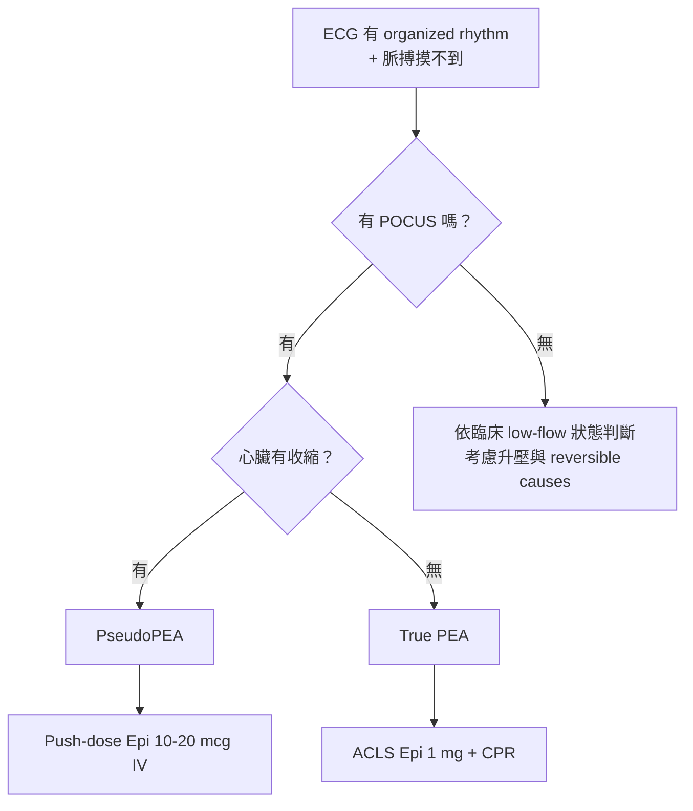

# 2026 台北市 EMTP 複訓 — 學員講義

> ALS 病生理學 & 藥物動力學 | 4 小時課程

---

## M01 瀕死生理四大支柱

| 支柱 | 監測指標 | 處置方向 |
|:---:|:---:|:---:|
| **氧合** Oxygenation | SpO2 | 給氧 (O2 therapy) |
| **通氣** Ventilation | EtCO2, RR | 輔助呼吸 (BVM/ETT) |
| **灌流** Perfusion | BP, HR, CRT, 意識 | 輸液/升壓藥 |
| **代謝** Metabolism | pH, Base Excess | 矯正根本原因 |

---

## 氧合 vs 通氣 — 快速決策

| 情境 | SpO2 | RR | 判斷 | 處置 |
|---|:---:|:---:|---|---|
| 肺炎/肺水腫 | 低 | 快 | **氧合問題** | 高濃度氧 |
| OD/頭部外傷 | 低 | 慢/淺 | **通氣問題** | BVM/插管 |
| CO2 蓄積 | 正常 | 正常/慢 | 通氣衰竭 | 看 EtCO2 |

---

## 休克三階段

```
代償期                    失代償期                  不可逆期
Compensated              Decompensated             Irreversible
─────────────────────────────────────────────────────────────→

HR↑ SVR↑ BP正常           BP↓ HR↑↑ 意識不清          多重器官衰竭
周邊濕冷 焦躁              乳酸堆積 尿量減少          即使BP回來仍死亡

★ 搶救黃金期！             酸中毒 → 升壓藥效果差      治療已無效
```

### 乳酸代謝：為什麼休克會酸？

| | 有氧代謝（正常灌流） | 無氧代謝（休克/缺氧） |
|---|---|---|
| **路徑** | 葡萄糖 → 丙酮酸 → 粒線體（TCA cycle） | 葡萄糖 → 丙酮酸 → **乳酸 + H⁺** |
| **ATP 產量** | **36 ATP** | **2 ATP**（效率剩 1/18） |
| **副產物** | CO₂ + H₂O（可正常排出） | **乳酸堆積 → pH↓** |

> **死亡螺旋**：乳酸堆積 → pH↓ → 心肌收縮力↓ + 血管對升壓藥反應↓ → 灌流更差 → 產生更多乳酸 → 循環惡化……
>
> **院前處置核心**：恢復灌流 = 清除乳酸的唯一途徑。EtCO₂ 從極低值回升可間接提示灌流改善。

---

## 灌流評估三角 (Pump / Pipe / Tank)

| 評估面向 | 檢查項目 | 異常提示 |
|:---:|---|---|
| **Pump** 心臟 | Rate, Rhythm, Contractility | 心因性休克 |
| **Pipe** 血管 | 脈壓差, CRT, 皮膚溫度 | 分布性/阻塞性休克 |
| **Tank** 容量 | JVD, 黏膜, 肺音 | 低血容性休克 |

---

## Nohria-Stevenson 矩陣（心衰/休克分類）

```
                灌流（Perfusion）
              Warm（溫暖）     Cold（冰冷）
         ┌──────────────┬──────────────┐
Dry      │  A 正常/穩定   │  L 低血容性    │
(乾)     │              │  休克 (S02)    │
Congestion├──────────────┼──────────────┤
Wet      │  B 肺水腫      │  C 心因性      │
(濕)     │  SCAPE → NTG  │  休克+APE (S05)│
         └──────────────┴──────────────┘
```

| 象限 | 特徵 | 處置方向 |
|:---:|---|---|
| **A** Warm+Dry | 穩定代償 | 觀察 |
| **B** Warm+Wet | 肺水腫為主、四肢溫暖 | **NTG + CPAP/BiPAP** |
| **L** Cold+Dry | 低灌流、肺音乾淨 | 輸液試探 |
| **C** Cold+Wet | 低灌流 + 肺水腫（最危險） | **升壓/強心（不能輸液！）** |

---

## SCAPE 處置速查

> SCAPE = Sympathetic Crashing Acute Pulmonary Edema

- **辨識**：高血壓 + 急性雙側囉音 + 端坐呼吸 + 粉紅泡沫痰
- **處置**：NTG SL 0.4 mg（可重複）+ CPAP 10 cmH₂O + 坐姿 + 高流量 O₂
- **注意**：SCAPE ≠ volume overload → Furosemide 不是首選

### NTG 在 SCAPE 的雙重機轉

| 效果 | 機轉 | 臨床意義 |
|:---:|---|---|
| **降前負荷 (Preload ↓)** | 低劑量即擴張靜脈 → 血液滯留於周邊靜脈 → 回心血量減少 | 降低肺靜脈壓 → **直接緩解肺充血與肺水腫** |
| **降後負荷 (Afterload ↓)** | 較高劑量時擴張動脈 → 全身血管阻力 (SVR) 下降 | 降低左心室射血阻力 → 改善心輸出量、降低心肌耗氧 |

> **記憶口訣**：低劑量「開靜脈水庫」→ 血從肺回流到周邊（解肺水腫）；高劑量「開動脈閘門」→ 心臟更容易打出去（降 SVR）。
>
> **禁忌**：SBP < 90 mmHg、右心室梗塞（RV infarct 依賴前負荷維持輸出）、近期使用 PDE5 抑制劑（如 Sildenafil）。

---

## PseudoPEA 辨識流程



| 項目 | True PEA | PseudoPEA |
|---|---|---|
| 心臟 | 無有效收縮 | **有收縮但太弱** |
| POCUS | 不動/蠕動 | **可見收縮** |
| 處置 | CPR + Epi 1mg | **Push-dose epi 10-20 mcg** |
| 預後 | < 1% | **ROSC 70%+** |

> **提醒**：若無法在不延長 rhythm-check 暫停下快速確認 pseudoPEA，不要為了鑑別拖慢標準 resuscitation 節奏。

---

## 酸鹼與 EtCO2

- 休克/DKA 病人 → EtCO₂ 偏低（< 25 mmHg）= **代償性過度通氣**（吹掉 CO₂ 來代償酸中毒）
- **若 EtCO₂ 自行回升至 35–45** → 代表代償系統逐漸失敗 → 準備惡化
- **插管後避免通氣過快** → 須匹配病人原本的高 RR，維持代償

---

## 插管三殺 Red Flags（Peri-intubation Kill）

| 情境 | 風險 | 對策 |
|---|---|---|
| **插管前低血氧** | 拔除面罩/BVM 嘗試插管時，SpO₂ 急降 → 誘發致命心律不整 | 充分預氧合（Pre-oxygenation），必要時 DSI（延遲續發性插管） |
| **插管前低血壓** | PPV 減少回心血流，加上藥物血管擴張 → BP 崩盤 | 先 Fluid/Vasopressor 穩住 BP 再插管 |
| **酸中毒病人插管** | 接管後 RR 不足以代償 → pH 驟降 | 匹配病人原本的高 RR（過度通氣代償）

---

## M02 給藥途徑比較

| 途徑 | Onset | 適用 | 瀕死注意 |
|:---:|:---:|---|---|
| **IV** | 10-30 sec | ALS 黃金標準 | 推藥後 Flush, 上肢優於下肢 |
| **IO** | 30-60 sec | IV 失敗/延遲時合理替代 ⚠️ 非首選 | Humeral 常較快接近中心循環；Tibial 仍可接受；清醒病人痛；2025 AHA: IV first |
| **IM** | 5-15 min | 躁動/無法 IV | **休克禁用!** Late Dump 風險（灌流恢復後肌肉蓄積藥物突然釋出，造成藥效過量） |
| **IN** | 3-5 min | 兒童/止痛 | 每孔 < 1mL; 鼻血無效 |

---

## 特殊情境用藥調整

| 情境 | 原則 |
|---|---|
| **休克/低灌流** | Start Low, Go Slow; Paralytics onset 延遲 |
| **心搏停止** | IV/IO 後 Flush 20mL + 抬高; ROSC 後 Epi 蓄積注意 |
| **老年人** | Midazolam/Fentanyl 起始劑量減 25–50%（依體重、肝腎功能、意識狀態調整）; 脂溶性藥物分布容積大、排除慢 → 藥效延長 |

---

## 藥物速查表（ACLS 2020 通用劑量）

### 循環與強心（含升壓劑）

| 藥物 | 適應症 | 劑量 | 關鍵提醒 |
|---|---|---|---|
| **Epinephrine** | OHCA | IV/IO 1 mg push + flush, q3-5min | — |
| **Epinephrine** | Anaphylaxis | IM 0.3-0.5 mg (1:1,000) q5-15min | 休克→改 IV |
| **Amiodarone** | VF/pVT | 1st 300mg bolus → 2nd 150mg | 活人慢滴! |
| **Adenosine** | SVT | 6mg rapid push → 12mg x2 | **不稀釋**原液推；1-2 秒內打完 + 立即 **20mL NS flush** + 抬手臂；半衰期 <10s |
| **Norepinephrine** | Shock | 0.01-0.5 mcg/kg/min IV drip（從低劑量 titrate） | 外滲壞死風險；Warm/Distributive shock 首選升壓 |
| **Dobutamine** | Cold+Wet (SBP>70-80) | 2-20 mcg/kg/min IV drip | 強心劑 (Inotrope)；SBP 極低時需先用 Norepi 撐起血壓再加 |

### 血管擴張 & 利尿

| 藥物 | 適應症 | 劑量 | 關鍵提醒 |
|---|---|---|---|
| **NTG** | SCAPE/APE（Warm+Wet） | SL 0.4 mg q3-5min / IV 10-200 mcg/min | 低劑量降前負荷（擴靜脈）、高劑量降後負荷（擴動脈）; **SBP<90 禁用**; RV infarct 禁用; 近 24-48 hr 內使用 PDE-5 抑制劑（Sildenafil/Tadalafil）禁用 |
| **Furosemide** | Volume overload 肺水腫 | 20-80 mg IV | Flash APE ≠ volume overload → 非首選 |

### 鎮靜止痛 & 呼吸

| 藥物 | 適應症 | 劑量 | 關鍵提醒 |
|---|---|---|---|
| **Midazolam** | Seizure | IM 10mg / IV 5mg / IN 0.2mg/kg | 老人減半; 呼吸抑制 |
| **Midazolam** | Sedation | IV 2-5mg / IM 5mg | 老人減半; 呼吸抑制 |
| **Fentanyl** | Analgesia | IV 1-2mcg/kg / IN 1.5mcg/kg | **不釋放組織胺 → 血壓穩定**; 胸壁僵硬(罕見) |
| **Morphine** | Analgesia | IV 2-4mg q5-15min | ⚠️ **組織胺釋放 → 低血壓**; 休克病人避免使用 |
| **Ketamine** | Analgesia (sub-dissociative) | IV **0.1-0.3 mg/kg** 慢推 / IN 0.5-1 mg/kg | 不抑制呼吸、不降血壓；噁心/幻覺可能；RSI 劑量不同（1-2 mg/kg） |
| **Salbutamol (= Albuterol)** | Bronchospasm | 2.5mg nebulizer q15-20min | Tachycardia；Combivent 為 Salbutamol + Ipratropium 複方，非單方 |

> **止痛選藥口訣**：休克/血壓不穩 → Fentanyl 或 Ketamine（兩者均不降血壓）；避免 Morphine（組織胺 → 低血壓）。Ketamine sub-dissociative（0.1-0.3 mg/kg）遠低於 RSI 劑量（1-2 mg/kg），不會造成解離。

---

## Push-dose Epinephrine 泡製

```
【二階段稀釋法】（台灣 1:1,000 安瓿適用）

Step 1: 取 Epi 1:1,000 (1 mg/1 mL) 抽 1 mL
        ＋ N/S 抽至共 10 mL → 濃度 100 mcg/mL
Step 2: 從 Step 1 再抽 1 mL (= 100 mcg)
        ＋ N/S 抽至共 10 mL → 濃度 10 mcg/mL ✔

給藥: 每次 1–2 mL (10–20 mcg) slow IV push
      每 1–2 分鐘 titrate 至 SBP > 90
```

---

## RSI in Shock：劑量調整原則

| 藥物類別 | 調整 | 原因 |
|---|---|---|
| **鎮靜劑**（Ketamine, Midazolam 等） | **減半或更低** | CO↓ → 藥物集中中央循環 → 效果增強；低血壓副作用在休克更致命 |
| **肌鬆劑**（Succinylcholine, Rocuronium） | **維持標準劑量或略增** | 確保完全鬆弛、一次成功插管；休克時分布慢但需完整效果 |

> **口訣**：休克插管「鎮靜減半、肌鬆足量」
>
> Ref: Walls & Murphy, *Manual of Emergency Airway Management*, 6th Ed; NAEMSP/AMLS Guidelines

---

## 高體溫 + 交感興奮鑑別：三大易混淆

| | **擬交感神經中毒**<br>Sympathomimetic Toxidrome | **血清素症候群**<br>Serotonin Syndrome | **熱傷害**<br>Heat Illness |
|---|---|---|---|
| **常見原因** | 安非他命、古柯鹼、MDMA、卡西酮（浴鹽） | SSRI/SNRI 合併 MAOi、Tramadol、Meperidine、MDMA | 環境高溫 + 脫水、運動、抗膽鹼藥物 |
| **體溫** | ↑（可 > 40°C） | ↑（可 > 41°C） | ↑↑（Heat stroke > 40°C） |
| **瞳孔** | **散大 (Mydriasis)** | **散大** | 正常或散大 |
| **皮膚** | **多汗 (Diaphoresis)** | **多汗** | Heat stroke：**乾熱無汗**；Heat exhaustion：多汗 |
| **神經肌肉** | 躁動、震顫、癲癇 | **陣攣 (Clonus)**、肌僵硬（下肢 > 上肢）、反射亢進 | 意識改變、癲癇、共濟失調 |
| **鑑別關鍵** | 交感亢進為主、無 Clonus | ✅ **Clonus + 反射亢進** 是最大特徵 | 環境暴露史、皮膚乾熱 |

### 對策

| 狀況 | 處置重點 |
|---|---|
| **擬交感神經中毒** | ① **BZD 為主**（Midazolam 5 mg IV/IM，可重複）控制躁動與癲癇 ② 積極降溫（冰敷、噴霧風扇） ③ 監測心律（QTc 延長 → Torsades 風險） ④ **避免 β-blocker**（unopposed α → 冠狀動脈痙攣） |
| **血清素症候群** | ① **停用所有血清素藥物** ② BZD 控制躁動 ③ 嚴重者：**Cyproheptadine**（院內，PO 12 mg loading） ④ 積極降溫 ⑤ 避免肌肉僵硬導致 rhabdomyolysis → 輸液維持尿量 |
| **熱傷害** | ① **立即降溫**：移至陰涼處、脫衣、冰敷（腋下/鼠蹊/頸部）、噴霧風扇法 ② Heat stroke（意識改變 + T > 40°C）= **急救優先**，降溫比送醫更重要 ③ 輸液補充（NS） ④ 監測意識與核心體溫 |

> **記憶口訣**：三者都「燒、快、亂」（高體溫、心搏過速、意識改變），但 **Clonus 想血清素、毒物史想交感、環境史想熱傷害**。

---

## 高風險錯誤防呆 5 條

1. **Push-dose Epi 稀釋錯誤**: 忘記做第二次稀釋（打成 100 mcg/mL）→ 等於給了目標劑量的 10 倍，極危險
2. **休克打 IM**: 血流不到肌肉 → 改用 IV/IO
3. **追藥太快**: 尊重 circulation time, 至少等 3 min
4. **IO 忘 Flush**: 每次給藥後 20 mL NS flush + 抬高肢體
5. **Amiodarone 活人快推**: 非 arrest → 10-15 min 慢滴

---

## 院前敗血症速查

### qSOFA 快速篩檢（≥ 2 項 → 高度懷疑）

| 項目 | 閾值 |
|---|---|
| 呼吸速率 | **RR ≥ 22** /min |
| 意識改變 | **GCS < 15** |
| 收縮壓 | **SBP ≤ 100** mmHg |

### 院前處置流程

1. **氧合支持** → SpO₂ ≥ 94%
2. **建立 IV/IO** → 儘早
3. **輸液** → NS/LR **30 mL/kg**（首小時），分次 250-500 mL bolus
4. **血糖** → 低血糖即處理
5. **EtCO₂** → 監測酸中毒程度與灌流變化
6. **體溫** → 發燒或低體溫均記錄
7. **Sepsis Alert 通報** → 讓醫院備好抗生素 + 乳酸檢測

> **臨床進展提醒**：敗血症初期常為 **Warm shock**（四肢溫暖、脈壓寬、心輸出量代償性增加），但隨病情惡化會轉變成 **Cold shock**（四肢冰冷、脈壓窄、心臟衰竭）。
> 
> **口訣**：老人 + 喘 + 意識差 + 溫暖型低血壓 → 不是「只是虛弱」→ qSOFA → 輸液 + 通報
>
> 每延遲 1 小時抗生素，死亡率 ↑ 7.6%（Kumar 2006）。院前最重要的事 = **早期辨識 + 輸液 + 提早通報**。

---

## 過敏性休克 (Anaphylaxis) 速查

### 辨識四大系統徵兆（高度懷疑：接觸過敏原後急性發作，且具備下述 2 個系統以上表現）
- **皮膚/黏膜**：全身蕁麻疹、血管性水腫（顏面/唇舌/眼周）、潮紅發癢
- **呼吸**：呼吸困難、喘鳴 (Wheezing)、喉頭水腫、Stridor
- **心血管**：低血壓、休克、暈厥、搏動過速
- **腸胃**：腹部絞痛、嘔吐

### 處置步驟
1. **移除過敏原**（停止輸液/拔除蜂刺等）
2. **首選：Epinephrine IM**
   - **劑量**：0.3-0.5 mg (1:1,000 原液) **大腿前外側 IM**
   - **時機**：及早給予，勿等血壓掉才打。若症狀持續，每 5-15 分鐘可重複。
   - **注意**：若已進入**休克/循環衰竭**，IM 吸收極差，需改用 **IV Push-dose Epi** 或 **Epi drip**。
3. **氧合與氣道**：高濃度氧氣，若有嚴重喉頭水腫考慮早期插管（需資深人員，因氣道極度腫脹）
4. **輸液**：大口徑 IV，給予 1-2L NS/LR 補充血管內流失容積
5. **二線藥物**（醫院端/進階處置，不應延遲 Epi）：
   - 抗組織胺：Diphenhydramine 25-50 mg IV/IM
   - 類固醇：Methylprednisolone 125 mg IV 或 Hydrocortisone
   - 支氣管擴張：Salbutamol nebulizer (針對 persistent bronchospasm)

---

## ROSC 後前 5 分鐘 Pocket Card

> 依據 AHA 2025 Part 11: Post-Cardiac Arrest Care

### 氧合目標（Oxygenation）

| 目標 | 說明 |
|:---:|---|
| **SpO₂ 92–98%** | 避免過度氧化（Hyperoxia）與缺氧（Hypoxia）皆有害 |
| FiO₂ 從 100% 開始 | 待 SpO₂ 穩定後滴定下調 FiO₂ |

### 通氣目標（Ventilation）

| 目標 | 說明 |
|:---:|---|
| **PaCO₂ 35–45 mmHg** | 若以 EtCO₂ 監測，目標接近正常，避免 hyperventilation |
| 不追求「吹更快」 | 過度通氣會增加胸內壓並造成腦血管收縮 |

### 血壓目標（Hemodynamics）

| 目標 | 說明 |
|:---:|---|
| **MAP ≥ 65 mmHg** | 避免低血壓（Hypotension）；必要時使用升壓藥 |
| 首選 Norepinephrine | ROSC 後若血壓低，繼續或啟動 Norepi drip |

### 注意 Epi 蓄積（Post-ROSC Surge）

- ROSC 前每 3–5 分鐘給 Epi → ROSC 後可能積累 3–5 mg
- 表現：突發高血壓 / 心搏過速 / 新發心律不整
- 處置：密切監測 12 導程 ECG；勿再追加 Epi

### 移交優先順序（Handoff Priorities）

1. **ECG 12 導程** — 排除 STEMI / acute coronary lesion
2. **血糖** — 避免低血糖；目標 140–180 mg/dL
3. **通報接收醫院** — 若懷疑 ACS，告知可能需 primary PCI
4. **體溫管理** — 避免發燒（> 37.7°C 有害）
5. **依病因安排後續檢查** — 依臨床情境考慮 coronary evaluation / echo / CT

---

## 課堂筆記

_（請在此區記錄課堂重點）_

|  |  |
|---|---|
|  |  |
|  |  |
|  |  |
|  |  |
|  |  |

---

> **Protocol 聲明**: 藥物劑量依據 AHA ACLS 2020/2025 通用準則。實際執行請以台北市醫療指導醫師核准之在地 Protocol 為準。
>
> 2026 台北市 EMTP 複訓 | ALS 病生理學 & 藥物動力學
